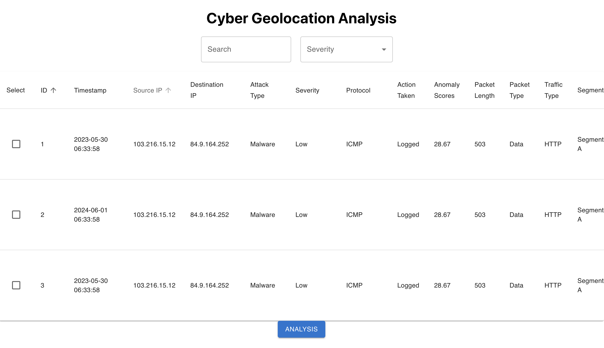

# CYGA - Cyber Geolocation Analysis
<div align="center">

</div>
Welcome to the repository for CYGA, the Cyber Geolocation Analysis tool designed to show data and insights. CYGA offers a powerful platform to track, analyze, and respond to cyber threats with precision and efficiency. This project is a web application built with React and Material-UI on the front end, Node.js and Express on the back end, and MySQL for the database. 

## Team Member
* [Yiran Dong](https://github.com/Rileyyiran)
* [Liang He](https://github.com/zaizaijiayou)
* [Yuqing Zhang](https://github.com/Yuqing-Zhang-branch)
* [Justin Wang](https://github.com/DroitXenon)  

## Files
- **database** folder: Files required for C2 and C3
- **client** folder: Files for front-end representation
- **server** folder: Files for back-end and server.js is the code for connecting app and database.
- **shared** folder: datasets, photos, etc.

## Data Scheme

<div align="center">


</div>

## Features

- **Search:** Enables users to quickly locate specific data in a cybersecurity database using queries like IP addresses, attack types, and incident IDs; results are displayed in an easily navigable table.

- **Filter:** Allows users to refine search results by severity and attack type directly from the interface, providing quick access to relevant information for effective trend analysis and incident management.

- **Select:** Allows users get AI-driven analysis and recommendations. Users check the boxes next to data entries and click the "Analysis" button. to receive AI-generated insights based on their selections. This makes data analysis easy and accessible.

- **Sort:** The Sort feature allows users to organize data. By clicking the arrow next to any entity, users can sort the data alphabetically. This helps users quickly find and analyze information.

    _Following features will be added in later version:_
- **Timestamping:** Every event is recorded with a precise timestamp, ensuring that you can track the sequence of events down to the millisecond.

- **Location Finding:** Quickly pinpoint the geographical origin of an attack with our advanced geolocation algorithms.

- **Attack Type Identification:** Our system classifies the nature of the attack, providing you with immediate insight into the potential threat.

- **Attack Analysis:** In-depth analysis of each attack helps you understand the attacker's methods and motives.

- **Data Statistics:** Comprehensive statistics offer a macro and micro view of the cyber threat landscape, aiding in strategic decision-making.

## Demo

Website:
<div align="center">

</div>
Database:
<div align="center">

</div>

## Prerequisites
- React for Front-end Development
- Node.js and Express.js for Back-end Development
- MySQL for Database Management
- OpenAI API key (Optional)

## Installation

### Backend Setup

1. **Clone the repository:**

    ```bash
    git clone https://github.com/DroitXenon/CYGA.git
    cd CYGA/server
    ```

2. **Install the dependencies:**

    ```bash
    npm install
    ```

3. **Update the MySQL connection details in `server.js`:**

    ```javascript
    const dbConfig = {
        host: process.env.DB_HOST || 'localhost',
        user: process.env.DB_USER || 'root', //Change to Your Own User Name
        password: process.env.DB_PASSWORD,  //Change to Your Own Password
    };
    ```

5. **Start the backend server:**

    ```bash
    node server.js
    ```

### Frontend Setup

1. **Navigate to the frontend directory:**

    ```bash
    cd ../client
    ```

2. **Update the OpenAI API Key in `server.js`:**

    ```javascript
    openai.apiKey = process.env.OPENAI_API_KEY; //Replace with your own API key
    ```

2. **Install the dependencies:**

    ```bash
    npm install
    ```

2. **Install the Material-UI Interface:**

    ```bash
    npm install @mui/material @mui/styled-engine @emotion/react @emotion/styled
    ```

3. **Start the React application:**

    ```bash
    npm start
    ```

## Usage

1. Open the browser and go to `http://localhost:3000`.
2. View the cyber attack incidents in the table.
3. Search the data by entering keywords in the search bar and pressing the [SEARCH] button.
4. Users can click on the column headers to sort the data.
5. Add data by clicking the [ADD] button and filling in the needed data and pressing [ADD] at the bottom.
6. Select the row using the checkboxes, and delete using the [DELETE] button.
7. Click on any incident bar, and the user will be automatically redirected to the detail page.
8. Click the "Analysis" button to analyze the selected rows using the OpenAI API.

## Technologies Used

- **Frontend:**
  - React
  - Material-UI

- **Backend:**
  - Node.js
  - Express

- **Database:**
  - MySQL

- **API:**
  - OpenAI API
