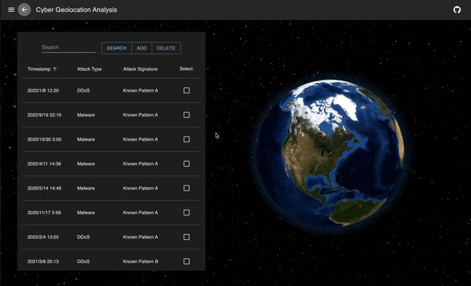

# CYGA - Cyber Geolocation Analysis
<div align="center">

</div>
Welcome to the repository for CYGA, the Cyber Geolocation Analysis tool designed to show data and insights. CYGA offers a powerful platform to track, analyze, and respond to cyber threats with precision and efficiency. This project is a web application built with React and Material-UI on the front end, Node.js and Express on the back end, and MySQL for the database. 



Team Member
-----------
* [Yiran Dong](https://github.com/Rileyyiran)
* [Liang He](https://github.com/zaizaijiayou)
* [Yuqing Zhang](https://github.com/Yuqing-Zhang-branch)
* [Justin Wang](https://github.com/DroitXenon)  

Directory Layout
----------------
```plaintext
CYGA/
├── .github/              
├── .vscode/              
├── client/               # Files for front-end representation
│   ├── node_modules/     
│   ├── public/           
│   ├── src/              # Source code for the client
│   │   ├── components/   # React components
│   │   │   ├── IncidentDetails.js
│   │   │   ├── IncidentList.js
│   │   ├── App.css       # CSS styles
│   │   ├── App.js        # Main React application
│   │   ├── App.test.js   
│   │   ├── index.css     
│   │   ├── index.js      
│   │   ├── logo.svg      
│   │   ├── reportWebVitals.js
│   │   ├── setupTests.js 
│   ├── package.json      
│   ├── package-lock.json 
├── database/             # Files required for C2 and C3
│   ├── create-table.sql
│   ├── test-production.out
│   ├── test-production.sql
│   ├── test-sample.out
│   ├── test-sample.sql
├── server/               # Files for back-end and server.js is the code for connecting app and database.
│   ├── node_modules/     
│   ├── tests/            
│   ├── .env              # Environment variables for the server
│   ├── package.json      
│   ├── package-lock.json 
│   ├── server.js         # Main server application
├── shared/               # Shared assets and constants
│   ├── constants/        # datasets, photos, etc.
│   │   ├── capture.png
│   │   ├── course_project.pdf
│   │   ├── cybersecurity_attacks_enu.csv
│   │   ├── database.png
│   │   ├── demodetailpage.png
│   │   ├── demoamainpage.png
│   │   ├── earth-blue-marble.jpg
│   │   ├── earth-topology.png
│   │   ├── erdiagram.jpeg
│   │   ├── logo.png
│   │   ├── logotr.png
│   │   ├── night-sky.png
│   │   ├── Normalization.jpeg
│   │   ├── production_data.csv
│   │   ├── sample_data.csv
│   │   ├── scheme.jpeg
├── utils/            
│   ├── testutils/
├── .gitignore       
├── package.json     
├── package-lock.json 
├── README.md             # Project README file
```

Data Scheme
-----------
<div align="center">


</div>

Features
--------
- **Search:** The search feature is intended to help users, such as IT professionals and security analysts, easily find specific data within the cybersecurity database.

- **Add:** The add feature aims to improve user participation by allowing users to add new data entries to the cybersecurity database.The "Add" button, located conveniently at the bottom of the user interface, will open a modal in which users can enter critical information such as the timestamp, source IP address, protocol, and user information. 

- **Sort:** The sort feature allows users to organize data efficiently. By clicking the arrow next to every entity, users can sort the data in lexicographic order based on that entity.

- **Analysis** The analytics feature is available to every user who visits our site. This feature allows users to get analysis and recommendations. By clicking on any incident bar, the user will be automatically redirected to a new page showing all the details of the incident. Then click on the "Analyze" button on the bottom of the detail page. 

- **Edit** The edit feature provides users with the ability to modify existing data seamlessly. After clicking the "Edit" button, a pop-up window will appear. Users can select any attribute that they wish to update. Once an attribute is selected, users can input a new value for that element. Upon confirmation of the changes, the system will automatically update the database with the new values. This feature ensures that all data remains current and accurate, enhancing the overall user experience by allowing real-time updates and modifications. The intuitive interface makes it easy for users to make edits efficiently, contributing to a more dynamic and responsive data management process.

- **View** The view feature offers users a tailored data visualization experience. After clicking the "View" button, a pop-up window appears, displaying a list of available elements in the dataset. Users can select one or more attributes from this list according to their needs. Once the selection is made, the system generates a customized table that includes only the chosen attributes, excluding any irrelevant data. This feature allows users to focus on specific information, making data analysis more efficient and relevant to their requirements. The user-friendly interface ensures that users can easily navigate and customize their data view with just a few clicks.

- **Delete** The delete feature allows users to manage and remove existing data entries, keeping the cybersecurity database relevant and up to date. Users can select one or more entries using the checkboxes next to each data row, providing flexibility for managing bulk or individual records. 

- **Visualization** The visualization feature on our website enhances the user's ability to understand and interpret data related to cyberattack incidents. This feature includes a dynamic map with an interactive globe and dash between locations whenever a cyberattack incident is referenced. Leveraging the latitude and longitude information associated with each incident, users can easily visualize the geographic source and destination addresses. The map provides an intuitive and engaging way to view spatial relationships, making it easier to analyze the distribution and movement of cyberattacks. This visual representation is designed to be user-friendly, allowing users to quickly grasp complex geographic data and make informed decisions based on the visualized information.

- **MUI** By utilizing Google's Material Design principles, integrating a Material User Interface (MUI MD) into our cybersecurity program will significantly improve the user experience. This design concept has a strong emphasis on simple, contemporary aesthetics that combine responsive animations, transitions, and depth effects like dash around the Earth to produce an interface that is both visually appealing and easy to use. Our application will become more accessible and user-friendly by implementing MUI MD because Material Design was created with accessibility and responsive design in mind. Material Design integration will guarantee a consistent user experience for users using the application on desktop, tablet, or smartphone, facilitating efficient and effective navigation, understanding, and interaction with complex cybersecurity data. With this update, user engagement and happiness will be increased overall, and our application will be at the forefront of contemporary UI design trends. 

- **REST API** Efforts on improving query performance for handling millions of records or complex queries involving many joins or subqueries are paramount for efficient data management. The "API endpoint" feature addresses this need by providing a robust interface for pulling data directly from the backend. By using the API endpoint, users can efficiently retrieve large datasets and execute complex queries with enhanced performance. This feature ensures that even the most demanding data retrieval tasks are handled swiftly and effectively, facilitating seamless integration and interaction with our backend systems. The API endpoint is designed to optimize data access, making it an essential tool for users requiring high-performance data operations.

- **Export** The export feature provides users with the ability to easily export analysis data into a PDF format. This functionality allows users to compile and save comprehensive reports of their data analyses, facilitating convenient sharing and offline access. By using the "Export" button, users can generate a well-structured PDF document that includes all relevant analysis details, ensuring that important information is preserved and readily accessible. This feature is designed to enhance the user's experience by providing a seamless method for documenting and distributing analysis results.

Getting Started
---------------
### Prerequisites
- MySQL (Version >= 8.0)
- [Node.js](https://nodejs.org/en/download/package-manager) (Version > v12.22.12)
- OpenAI API key (Optional)

### Installation

#### Backend Setup

1. Clone the repository:

    ```bash
    git clone https://github.com/DroitXenon/CYGA.git
    cd CYGA/server
    ```

2. Update the MySQL connection details in `server/.env`:

    ```bash
    DB_HOST=localhost
    DB_USER=root
    DB_PASSWORD= #Enter Password
    ```

3. (Optional) Update the OpenAI API Key in `server/.env`:

    ```Bash
    OPENAI_API_KEY= #Enter API Key
    ```

4. Install the dependencies:

    ```bash
    npm install
    ```

5. Start the backend server:

    ```bash
    node server.js
    ```
    If terminal shows ``
    CSV imported.
    ``, then the import is successful.
    

#### Frontend Setup

1. **Keep the backend terminal alive and create a new terminal.** Then navigate to the frontend directory:

    ```bash
    cd client
    ```

2. Install the dependencies:

    ```bash
    npm install
    ```

3. Start the React application:

    ```bash
    npm start
    ```

Usage
-----
1. Open the browser and go to `http://localhost:3000`.
2. View the cyber attack incidents in the table.
3. Search the data by entering keywords in the search bar and pressing the [SEARCH] button.
4. Users can click on the column headers to sort the data.
5. Add data by clicking the [ADD] button and filling in the needed data and pressing [ADD] at the bottom.
6. Select the row using the checkboxes, and delete using the [DELETE] button.
7. Click on any incident bar, and the user will be automatically redirected to the detail page.
8. Click the [Analysis"] button to analyze the selected rows using the OpenAI API.
9. Click the [Export] button to export the analysis into PDF.
10. Click the [View] button to select one or more specific columns.
11. Click the [Edit] button to update specific element values.
12. Select a specific incident to have a virtualization on the attacker and victims locations.
13. Click the arrow to go back to the previous page.


Technologies Used
-----------------
- **Frontend:**
  - React: Utilizes a component-based architecture ensuring a dynamic and seamless user experience.
  - Material-UI: Implements Google’s Material Design principles, providing an intuitive and aesthetically pleasing interface with responsive animations, transitions, and depth effects.
  - Globe.gl: For Visualization

- **Backend:**
  - Node.js: Allows for high-performance asynchronous processing, making it ideal for handling multiple simultaneous requests.
  - Express.js: A minimal and flexible Node.js web application framework, providing a robust set of features for building single and multi-page web applications.

- **Database:**
  - MySQL: Ensures efficient storage, querying, and management of large volumes of cybersecurity data, providing quick access and analysis capabilities.

- **API:**
  - OpenAI API
  - REST API
