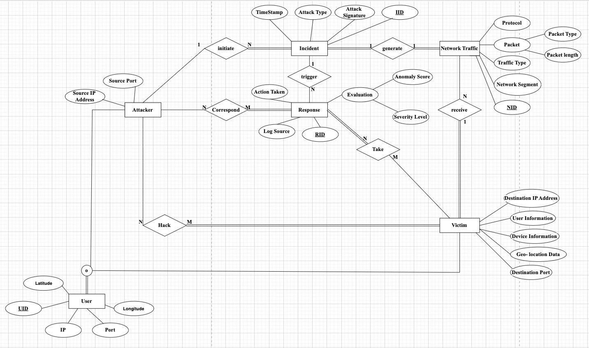

# CYGA - Cyber Geolocation Analysis
<div align="center">

</div>
Welcome to the repository for CYGA, the Cyber Geolocation Analysis tool designed to show data and insights. CYGA offers a powerful platform to track, analyze, and respond to cyber threats with precision and efficiency. This project is a web application built with React and Material-UI on the front end, Node.js and Express on the back end, and MySQL for the database. 


## Team Member
* [Yiran Dong](https://github.com/Rileyyiran)
* [Liang He](https://github.com/zaizaijiayou)
* [Yuqing Zhang](https://github.com/Yuqing-Zhang-branch)
* [Justin Wang](https://github.com/DroitXenon)  

## Files
- **database** folder: Files required for C2 and C3
- **client** folder: Files for front-end representation
- **server** folder: Files for back-end and server.js is the code for connecting app and database.
- **shared** folder: datasets, photos, etc.

## Data Scheme

<div align="center">



</div>

## Features

- **Search:** The search feature is intended to help users, such as IT professionals and security analysts, easily find specific data within the cybersecurity database.

- **Add:** The add feature aims to improve user participation by allowing users to add new data entries to the cybersecurity database.The "Add" button, located conveniently at the bottom of the user interface, will open a modal in which users can enter critical information such as the timestamp, source IP address, protocol, and user information. 

- **Sort:** The sort feature allows users to organize data efficiently. By clicking the arrow next to every entity, users can sort the data in lexicographic order based on that entity.

- **Delete** The delete feature allows users to manage and remove existing data entries, keeping the cybersecurity database relevant and up to date. Users can select one or more entries using the checkboxes next to each data row, providing flexibility for managing bulk or individual records. 

- **Analysis** The analytics feature is available to every user who visits our site. This feature allows users to get analysis and recommendations. By clicking on any incident bar, the user will be automatically redirected to a new page showing all the details of the incident. Then click on the "Analyze" button on the bottom of the detail page. 

Following features will be added in later version:

- **Visualizing** By using Globe.GL and Earth API, quickly pinpoint the geographical origin of an attack.

- **Timestamping:** Every event is recorded with a precise timestamp, ensuring that you can track the sequence of events down to the millisecond.

- **Data Statistics:** Comprehensive statistics offer a macro and micro view of the cyber threat landscape, aiding in strategic decision-making.

## Demo
Website:
[Main Page]
<div align="center">

</div>
[Detail Page]
<div align="center">

</div>
Database:
<div align="center">

</div>

## Prerequisites
- React for Front-end Development
- Node.js and Express.js for Back-end Development
- MySQL for Database Management
- OpenAI API key (Optional)

## Installation

### Backend Setup

1. **Clone the repository:**

    ```bash
    git clone https://github.com/DroitXenon/CYGA.git
    cd CYGA/server
    ```

2. **Update the MySQL connection details in `server.js`:**

    ```javascript
    const dbConfig = {
        host: process.env.DB_HOST || 'localhost',
        user: process.env.DB_USER || 'root', //Change to Your Own User Name
        password: process.env.DB_PASSWORD,  //Change to Your Own Password
    };
    ```

3. **(Optional) Update the OpenAI API Key in `server.js`:**

    ```javascript
    openai.apiKey = process.env.OPENAI_API_KEY; //Replace with your own API key
    ```

4. **Install the dependencies:**

    ```bash
    npm install
    ```

5. **Start the backend server:**

    ```bash
    node server.js
    ```

### Frontend Setup

1. **Keep the backend terminal alive, create a new terminal and navigate to the frontend directory:**

    ```bash
    cd CYGA/client
    ```

2. **Install the dependencies:**

    ```bash
    npm install
    ```

3. **Start the React application:**

    ```bash
    npm start
    ```

## Usage

1. Open the browser and go to `http://localhost:3000`.
2. View the cyber attack incidents in the table.
3. Search the data by entering keywords in the search bar and pressing the [SEARCH] button.
4. Users can click on the column headers to sort the data.
5. Add data by clicking the [ADD] button and filling in the needed data and pressing [ADD] at the bottom.
6. Select the row using the checkboxes, and delete using the [DELETE] button.
7. Click on any incident bar, and the user will be automatically redirected to the detail page.
8. Click the "Analysis" button to analyze the selected rows using the OpenAI API.

## Technologies Used

- **Frontend:**
  - React
  - Material-UI

- **Backend:**
  - Node.js
  - Express

- **Database:**
  - MySQL

- **API:**
  - OpenAI API
